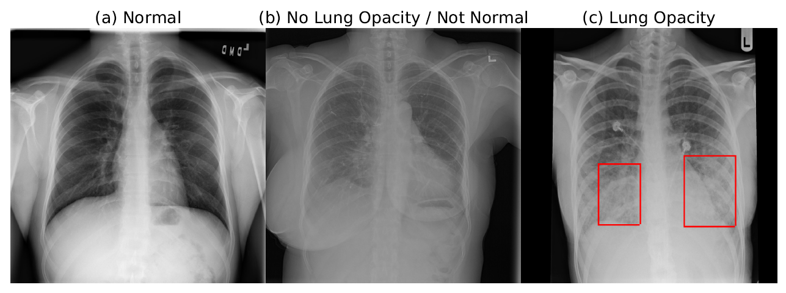
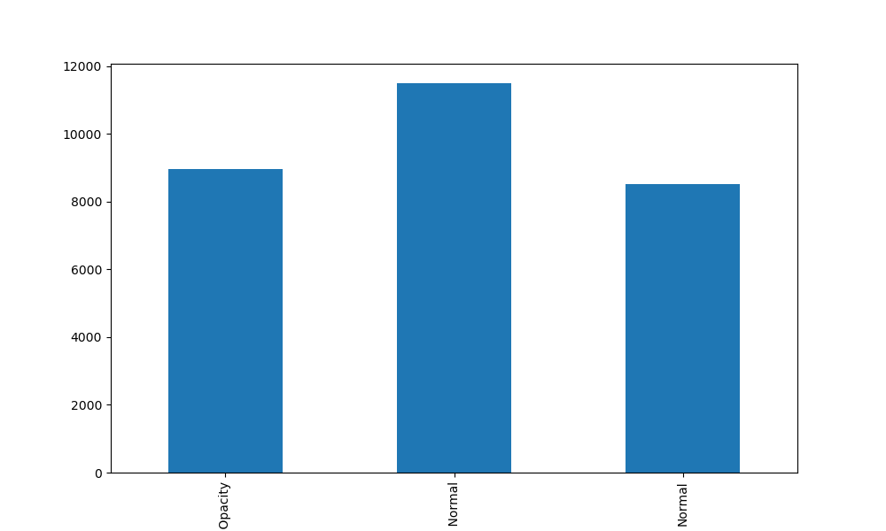
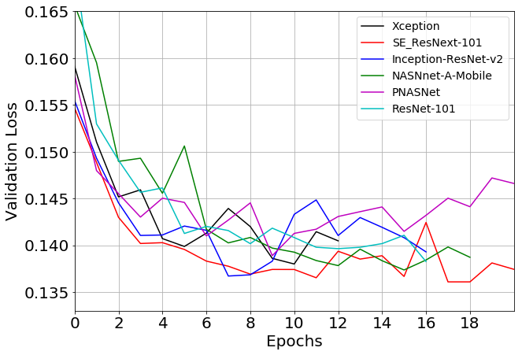

# 基于2K1000LA的肺炎检测检测

肺炎是幼儿死亡的主要原因，也是全世界最大的死亡原因之一。肺炎检测通常由训练有素的专家通过检查胸部 X 线片进行。这个过程很乏味，通常会导致放射科医生之间的分歧。计算机辅助诊断系统显示出提高诊断准确性的潜力。在这项工作中，我们开发了基于单次检测器、挤压和消光深度卷积神经网络、增强和多任务学习的肺炎区域检测计算方法。

## 介绍
此代码基于[Dmytro Poplavskiy](https://www.kaggle.com/dmytropoplavskiy) 的原始 [第二名的解决方法](https://github.com/pdima/kaggle_RSNA_Pneumonia_Detection) 和 [Pytorch RetinaNet](https://github.com/yhenon/pytorch-retinanet) 在龙芯2K1000LA平台上实现。训练部分使用了云GPU，预测采用的为CPU预测。

## 数据集
胸部X射线（CXR）图像和患者元数据的标记数据集由美国国立卫生研究院临床中心公开提供。[数据集](https://www.kaggle.com/c/rsna-肺炎检测-挑战)可在kaggle平台上找到。

该数据库包括来自26684名独特患者的正面X射线图像。每个图像都标有相关放射报告中的三个不同类别之一：“正常”，“无肺混浊/不正常”，“肺混浊”。

Fig. 1 显示了所有三个类别 CXR 的示例，这些 CXR 标有不健康患者的边界框。

Fig. 1 显示了所有三个类别 CXR 的示例，这些 CXR 标有不健康患者的边界框。

数据分布良好

Fog. 2 数据分布良好

## 指标
挑战中提供了评估指标。使用不同交集联合（IoU）阈值下的平均平均精度（mAP）评估模型。[在此处查看评估](https://www.kaggle.com/c/rsna-pneumonia-detection-challenge/overview/evaluation)。
实现的 mAP 指标计算采用 `src/metric.py`

## 模型
该模型基于 Pytorch 上的 [RetinaNet](https://github.com/yhenon/pytorch-retinanet)实现，几乎没有修改。已经测试了许多不同的基本模型架构。图2显示了一系列各种主干的验证损耗。SE型网表现出最佳性能，se-resnext101显示出最好的结果，se-resnext50稍差。

Fig. 3 一系列模型的验证损失历史记录

## 图像预处理和增强
原始图像缩放为 512 x 512 像素分辨率。256 分辨率会导致结果下降，而完整的原始分辨率（通常超过 2000 x 2000 像素）对于较重的基本模型不切实际。

由于原始挑战数据集不是很大，因此图像增强有利于减少过度拟合。带有增强功能的数据集位于`src/datasets/detection_dataset.py`

## 训练
使用的所有基础模型都是在ImageNet数据集上预先训练的。
对于学习率调度器，我们在 Pytorch ReduceLROnPlateau 中使用了patience为 4，lr为 0.2。配备SE-ResNet101网络的RetinaNet单次探测器表现出最佳结果，其次是SE-ResNet50。整个训练大约需要 12 个 epoch，在 云GPU P100 上每个 epoch 需要 50 分钟。

## 如何安装和运行

### 准备训练数据
要从 kaggle 下载数据集，需要有一个 kaggle 帐户，加入比赛并接受条件，获取 kaggle API 令牌并将其复制到 .kaggle 目录。之后你可以运行命令行中的`bash dataset_download.sh`。用于下载和解压缩数据的脚本位于`scripts/dataset_download.sh` 中。

### 环境准备
1. 安装anaconda
2. 你可以通过创建新环境的方法来创建一个新的环境，然后安装依赖项。或者，你可以使用`conda install --file requirements.txt`安装依赖项。

### 实验实现
在 `config.py` 中设置自己文件的路径。

运行 `src/train_runner.py` 并将其中的 `args.action == "train"` 改为训练模式, 
使用 `args.action == "check_metric` 来确定训练结果的分数, 并且将 `args.action == "generate_predictions"` 用于生成预测。

根据预测，您可以使用`src/scores.py`计算NMS阈值范围的mAP分数，并通过以下方式可视化不同运行和模型的保存
`src/visualizations/plot_metrics.py`

